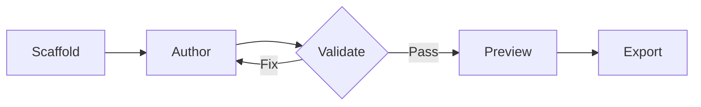
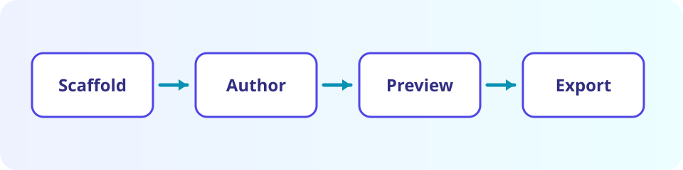

# Markdown Artifact Showcase

This package-owned demo exercises the portable Markdown features supported by
`pi-artifacts`. It is rendered directly from the installed package and never
enters your artifact store.

> [!NOTE]
> Markdown artifacts stay readable as ordinary text while gaining richer
> previews for math, diagrams, code, alerts, and local assets.

## Project snapshot

| Metric            | Current | Target | Status      |
| ----------------- | ------: | -----: | ----------- |
| Features shipped  |      12 |     14 | On track    |
| Test coverage     |     91% |    90% | Complete    |
| Open design items |       3 |      0 | In progress |

### Delivery checklist

- [x] Define the artifact bundle
- [x] Validate portable Markdown
- [x] Render a localhost preview
- [ ] Share the final report

## Math and analysis

Inline math works naturally: $E = mc^2$. Display math is useful for a model or
summary calculation:

$$
\text{completion rate} = \frac{12}{14} \times 100 \approx 85.7\%
$$

## Workflow diagram



## Highlighted code

```ts
const artifact = {
  stack: "markdown",
  portable: true,
  status: "ready",
};
```

## Local assets



The image above ships inside this demo bundle, so previews and standalone
exports do not depend on an external URL.[^portable]

[^portable]: Portable exports embed referenced bundle assets and required package runtime resources into one HTML file.
